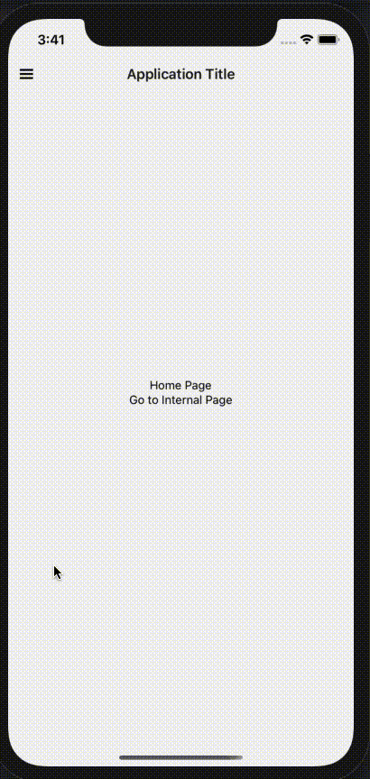

## About the Project

React-Native example project of Drawer Animated.

## Installation

1. Run: `yarn` for instalation of dependencies
2. For each platform (iOS/Android) you plan to use, follow one of the options for the corresponding platform.

#### Android

`yarn android`

#### IOS

`yarn ios`

## Libraries & Versions

react-native 0.63.3

react-native-vector-icons 7.1.0

@react-navigation/native 5.8.9

## License

This project is licenced under the [MIT License](http://opensource.org/licenses/mit-license.html).

Any bundled fonts are copyright to their respective authors and mostly under MIT or [SIL OFL](http://scripts.sil.org/OFL).
